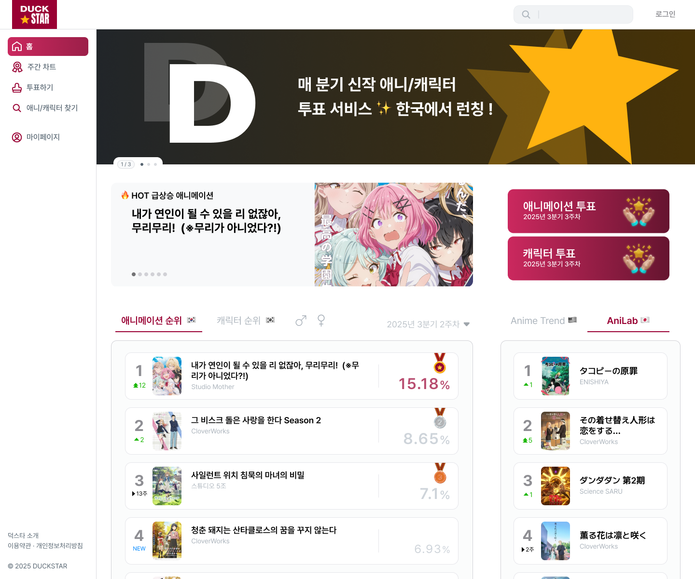
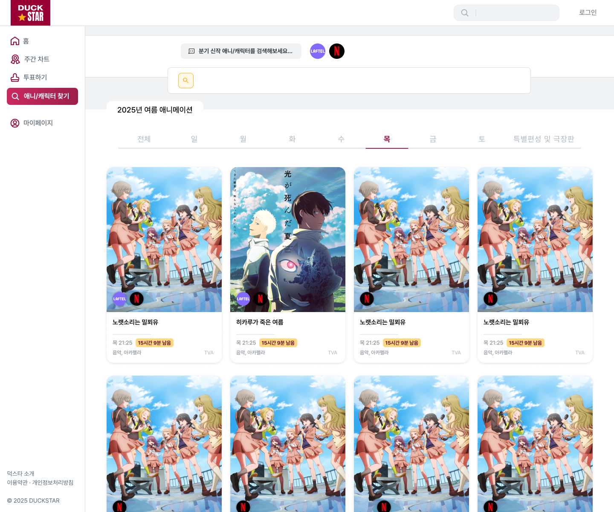

# DUCK⭐️STAR - 애니메이션 투표 플랫폼

<div align="center">
  
  
  [](https://nextjs.org/)
  [](https://spring.io/projects/spring-boot)
  [](https://www.typescriptlang.org/)
  [](https://www.java.com/)
  [](https://www.mysql.com/)
  [](https://www.docker.com/)
</div>

## 📋 프로젝트 개요

이번 분기의 마음에 드는 애니메이션과 캐릭터에 투표하세요!
<br/>
**Duckstar**는 분기 신작 애니메이션 팬들을 위한 주차별 투표와 차트 제공 플랫폼입니다.
<br/>
일요일마다 결과를 확인하며, 방영 애니메이션의 간략한 정보와 함께 다른 팬들과 소통할 수 있는 댓글 공간을 제공합니다.

### 🎯 주요 기능
- **실시간 투표 시스템**: 주차별 애니메이션 투표  **[구현 완료 ✅]**
- 차트 시스템: 주차별 애니메이션/캐릭터 순위 차트와 득표 정보 제공 **[Backend 구현 완료]**
- 애니메이션 홈: 애니메이션별 정보, 분기별 성적, 등장인물 **[Backend 구현 완료]**
- 커뮤니티 기능: 애니메이션별 댓글 및 답글 시스템 **[Backend 구현 완료]**
- 검색 기능 및 편성표: 애니메이션 및 캐릭터 검색, 분기별 애니메이션 편성 정보 제공 **[Backend 구현 완료]**
- OAuth 인증: 카카오 로그인 연동 **[Backend 구현 완료]**

## 🏗️ Architecture
```
[Frontend]
 ├─ Next.js + TypeScript
 │   └─ Tailwind CSS
 ↓
[Backend]
 ├─ Spring Boot API
 │   └─ QueryDSL + JPA
 ↓
[Database]
 └─ MySQL RDS

[Infra]
 ├─ Docker + Nginx + EC2
 └─ Vercel (프론트 호스팅)
```

## 🛠️ Tech Stack

### Backend
- **Spring Boot 3.5.4** - Java 기반 웹 프레임워크
- **Spring Security** - 인증 및 권한 관리
- **Spring Data JPA** - 데이터 접근 계층
- **QueryDSL** - 타입 안전한 쿼리 작성
- **JWT** - 토큰 기반 인증
- **SpringDoc OpenAPI** - API 문서화

### Frontend
- **Next.js 15.5.0** - React 기반 풀스택 프레임워크
- **TypeScript 5.0** - 타입 안정성
- **Tailwind CSS 4.1** - 유틸리티 기반 CSS 프레임워크
- **Framer Motion** - 애니메이션 라이브러리
- **SWR** - 데이터 페칭 라이브러리

### Database
- **MySQL 8.0** - 메인 데이터베이스
- **H2 Database** - 테스트 개발용 인메모리 데이터베이스

### DevOps
- **Docker & Docker Compose** - 컨테이너화
- **Nginx** - 리버스 프록시 및 로드 밸런싱
- **Gradle** - 빌드 도구

## 🚀 프로젝트 구조

```
duckstar/
├── frontend/                 # Next.js 프론트엔드
│   ├── src/
│   │   ├── app/
│   │   ├── components/
│   │   ├── api/
│   │   └── types/
│   └── public/
├── backend/                 # Spring Boot 백엔드
│   ├── src/main/java/
│   │   └── com/duckstar/
│   │       ├── domain/
│   │       │   ├── common/
│   │       │   ├── enums/
│   │       │   ├── mapping/
│   │       │   └── vo/
│   │       ├── web/
│   │       │   ├── controller/
│   │       │   ├── dto/
│   │       │   └── support/     # 웹 지원 클래스
│   │       ├── service/
│   │       ├── repository/
│   │       ├── security/    # 보안 및 인증
│   │       │   ├── config/
│   │       │   ├── domain/
│   │       │   ├── presentation/
│   │       │   ├── providers/
│   │       │   ├── repository/
│   │       │   └── service/
│   │       ├── apiPayload/  # API 응답 표준화
│   │       │   ├── code/           # 응답 코드 정의
│   │       │   └── exception/      # 예외 처리
│   │       ├── config/
│   │       ├── crawler/     # CSV 읽기
│   │       ├── validation/  # 유효성 검증
│   │       └── util/
│   ├── src/main/resources/
│   └── build.gradle
├── nginx/                   # Nginx 설정
└── docker-compose.yml       # Docker Compose 설정
```

## 🖼️ 디자인 데모

<div align="center">
  
  
  
  
  
  
</div>

<div align="center">
<br/>

**투표 페이지 준비 완료 ✅**: [Duckstar](https://duckstar.kr/vote) (투표 화면 외 기능들은 순차 배포 예정)

</div>

<div align="center">
  
<div align="center">
---

<div align="center">
  <p>Made by Godot-B</p>
  <p>© 2025 Duckstar. All rights reserved.</p>
</div>
